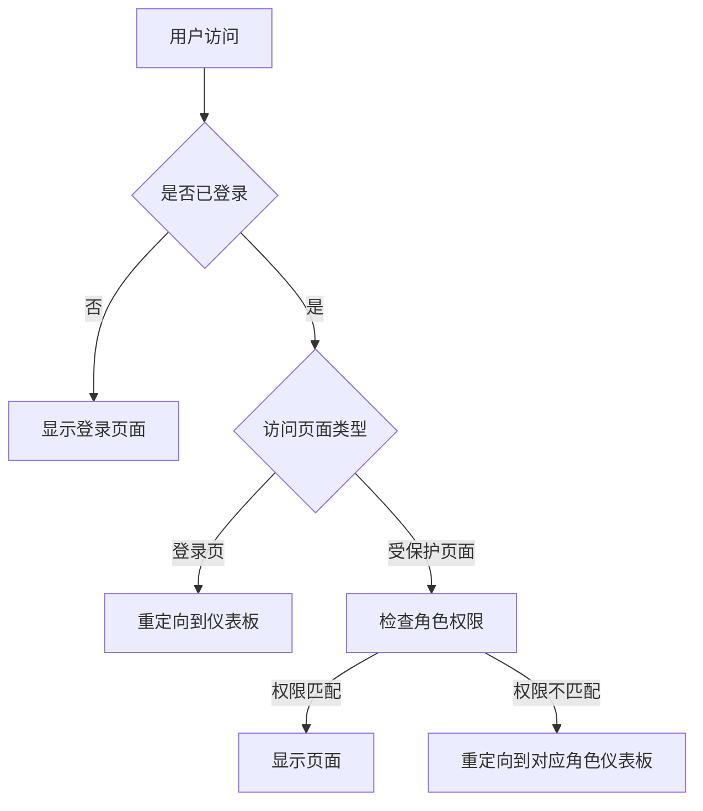
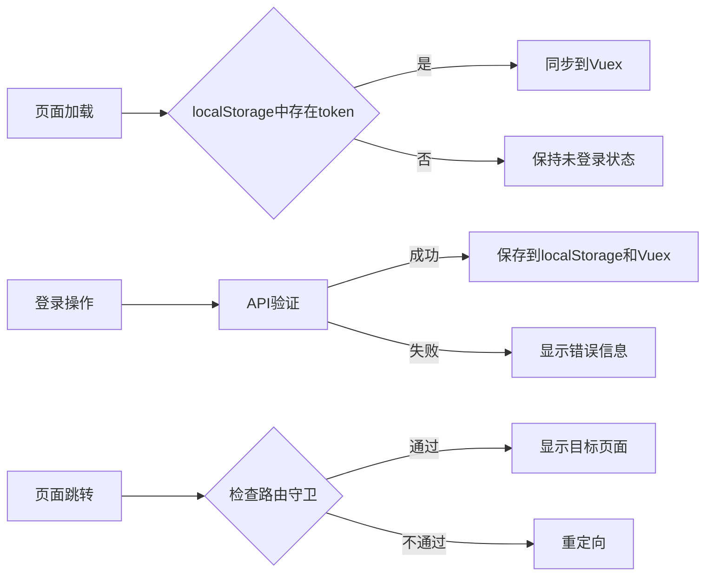

# 登录页面问题修复设计文档

## 1. 概述

本设计文档旨在解决登录成功后仍然显示登录页面及其他页面显示和功能问题，确保页面正常显示和使用。主要问题包括：
- 登录成功后页面未正确跳转
- 页面显示异常
- 相关功能未正常实现

## 2. 问题分析

通过分析现有代码，发现以下可能导致问题的原因：

### 2.1 路由守卫逻辑问题
当前路由守卫在`router/index.js`中实现，但可能存在逻辑缺陷导致页面跳转异常。

### 2.2 状态管理问题
Vuex store 中的状态同步可能存在问题，导致页面无法正确识别用户登录状态。

### 2.3 登录流程问题
登录成功后的页面跳转逻辑可能未正确执行。

### 2.4 响应拦截器问题
在`utils/api.js`中的响应拦截器可能在处理401错误时产生副作用。

## 3. 架构设计

### 3.1 系统架构图



### 3.2 状态管理流程图



## 4. 解决方案设计

### 4.1 优化路由守卫逻辑

修改`rent-app/vue-frontend/src/router/index.js`文件中的路由守卫逻辑：

```javascript
// 路由守卫
router.beforeEach((to, from, next) => {
  const isAuthenticated = localStorage.getItem('authToken')
  const userRole = localStorage.getItem('userRole')
  
  if (to.meta.requiresAuth && !isAuthenticated) {
    next('/login')
  } else if (to.path === '/login' && isAuthenticated) {
    // 如果已登录且访问登录页，根据角色重定向到对应仪表板
    switch(userRole) {
      case 'USER':
        next('/user')
        break
      case 'LANDLORD':
        next('/landlord')
        break
      case 'ADMIN':
        next('/admin')
        break
      default:
        next('/')
    }
  } else if (to.meta.role && isAuthenticated && to.meta.role !== userRole) {
    // 根据用户角色重定向到正确的仪表板
    switch(userRole) {
      case 'USER':
        next('/user')
        break
      case 'LANDLORD':
        next('/landlord')
        break
      case 'ADMIN':
        next('/admin')
        break
      default:
        next('/login')
    }
  } else {
    next()
  }
})
```

### 4.2 优化登录流程

修改`rent-app/vue-frontend/src/views/Login.vue`中的登录处理逻辑：

```javascript
const handleLogin = async () => {
  loginFormRef.value.validate(async (valid) => {
    if (valid) {
      loading.value = true
      try {
        const response = await userAPI.login({
          username: loginForm.username,
          password: loginForm.password
        })
        
        const { token, role } = response.data
        const user = {
          username: loginForm.username,
          role: role
        }
        
        // 保存认证信息到store
        store.dispatch('login', { token, user })
        
        ElMessage.success('登录成功')
        
        // 使用nextTick确保状态更新后再跳转
        await nextTick()
        
        // 根据用户角色跳转到相应仪表板
        switch(role) {
          case 'USER':
            router.push('/user')
            break
          case 'LANDLORD':
            router.push('/landlord')
            break
          case 'ADMIN':
            router.push('/admin')
            break
          default:
            router.push('/user')
        }
      } catch (error) {
        ElMessage.error('登录失败: ' + (error.response?.data?.message || error.message))
      } finally {
        loading.value = false
      }
    }
  })
}
```

### 4.3 优化响应拦截器

修改`rent-app/vue-frontend/src/utils/api.js`中的响应拦截器：

```javascript
// 响应拦截器
api.interceptors.response.use(
  response => {
    return response
  },
  error => {
    if (error.response && error.response.status === 401) {
      // 令牌过期或无效，清除本地存储并重定向到登录页
      localStorage.removeItem('authToken')
      localStorage.removeItem('currentUser')
      localStorage.removeItem('userRole')
      
      // 只有在当前不在登录页时才跳转
      if (window.location.pathname !== '/login') {
        window.location.href = '/login'
      }
    }
    return Promise.reject(error)
  }
)
```

### 4.4 加强状态同步

在`rent-app/vue-frontend/src/App.vue`中加强状态同步检查：

```javascript
export default {
  name: 'App',
  setup() {
    const store = useStore()
    const router = useRouter()
    
    const isLoggedIn = computed(() => store.getters.isLoggedIn)
    const currentUser = computed(() => store.getters.currentUser)
    
    // 页面加载时同步localStorage到store
    onMounted(() => {
      const token = localStorage.getItem('authToken')
      const user = JSON.parse(localStorage.getItem('currentUser') || '{}')
      const role = localStorage.getItem('userRole')
      
      if (token && user && role) {
        store.commit('SET_AUTH_TOKEN', token)
        store.commit('SET_CURRENT_USER', user)
        store.commit('SET_USER_ROLE', role)
      }
    })
    
    const logout = () => {
      store.dispatch('logout')
      router.push('/login')
    }
    
    return {
      isLoggedIn,
      currentUser,
      logout
    }
  }
}
```

## 5. 页面显示优化

### 5.1 添加加载状态管理
在Vuex store中添加全局加载状态：

```javascript
// 在state中添加
loading: false

// 添加mutations
SET_LOADING(state, loading) {
  state.loading = loading
}

// 添加actions
setLoading({ commit }, loading) {
  commit('SET_LOADING', loading)
}
```

### 5.2 优化页面切换动画
在App.vue中添加页面切换动画：

```html
<template>
  <div id="app">
    <el-container>
      <el-header>
        <h1>极简租房网站</h1>
        <div v-if="isLoggedIn" class="user-info">
          欢迎, {{ currentUser.username }} ({{ currentUser.role }})
          <el-button @click="logout" type="danger" size="small">退出登录</el-button>
        </div>
      </el-header>
      <el-main>
        <router-view v-slot="{ Component }">
          <transition name="fade" mode="out-in">
            <component :is="Component" />
          </transition>
        </router-view>
      </el-main>
    </el-container>
  </div>
</template>
```

```css
/* 添加过渡动画样式 */
.fade-enter-active, .fade-leave-active {
  transition: opacity 0.3s;
}

.fade-enter-from, .fade-leave-to {
  opacity: 0;
}
```

## 6. 核心实现要点

### 6.1 路由守卫实现要点
1. 确保在用户已登录时访问登录页面会自动重定向
2. 实现基于角色的访问控制
3. 处理页面刷新后的状态恢复

### 6.2 状态管理实现要点
1. 保证localStorage与Vuex状态同步
2. 实现状态变化的响应式更新
3. 处理退出登录时的清理工作

### 6.3 登录流程实现要点
1. 添加表单验证和错误处理
2. 实现加载状态提示
3. 确保登录成功后的正确跳转

## 7. 测试方案

### 7.1 登录流程测试
1. 验证正确凭据登录后能跳转到正确页面
2. 验证错误凭据登录时显示错误信息
3. 验证登录成功后刷新页面保持登录状态

### 7.2 页面跳转测试
1. 验证登录后访问登录页自动跳转到仪表板
2. 验证未授权访问受保护页面跳转到登录页
3. 验证角色权限控制正确性

### 7.3 状态管理测试
1. 验证localStorage与Vuex状态同步
2. 验证退出登录后状态清除
3. 验证页面刷新后状态恢复

## 8. 实施步骤

1. 修改路由守卫逻辑
2. 优化登录处理流程
3. 调整响应拦截器
4. 加强状态同步机制
5. 添加页面切换动画
6. 进行全面测试验证

## 9. 风险评估

1. 修改路由守卫可能影响其他页面访问逻辑
2. 状态同步机制调整可能影响现有功能
3. 需要确保修改不会引入新的安全漏洞