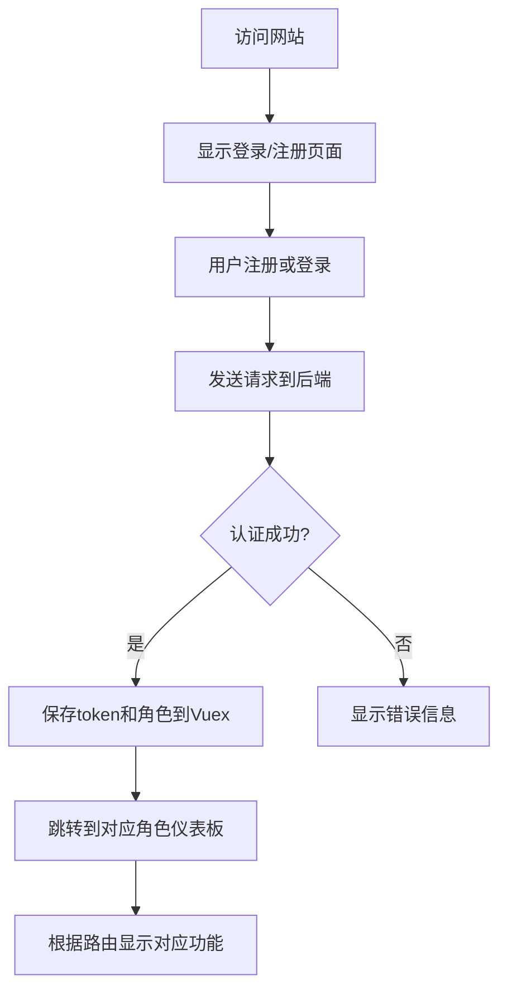

# 租房系统前端设计文档

## 1. 概述

本项目是一个基于Vue.js的租房网站前端实现，通过Axios与后端微服务进行交互。前端采用Vue组件化开发，包含了用户注册登录、房源搜索、房东功能和管理员功能等核心模块。

## 2. 技术栈与依赖

- Vue.js 3.x
- Vue Router (用于路由管理)
- Axios (用于HTTP请求)
- Element Plus (UI组件库)
- Vuex (状态管理)

## 3. 页面结构与组件架构

### 3.1 项目结构
```
src/
├── components/
│   ├── auth/
│   │   ├── Register.vue (注册组件)
│   │   └── Login.vue (登录组件)
│   ├── user/
│   │   ├── HouseSearch.vue (房源搜索组件)
│   │   └── ApplyLandlord.vue (申请房东组件)
│   ├── landlord/
│   │   ├── HouseUpload.vue (房源上传组件)
│   │   └── MyHouses.vue (我的房源组件)
│   └── admin/
│       ├── UserApproval.vue (用户审核组件)
│       ├── HouseApproval.vue (房源审核组件)
│       └── AllHouses.vue (所有房源组件)
├── views/
│   ├── Home.vue (首页)
│   ├── UserDashboard.vue (用户仪表板)
│   ├── LandlordDashboard.vue (房东仪表板)
│   └── AdminDashboard.vue (管理员仪表板)
├── router/
│   └── index.js (路由配置)
├── store/
│   └── index.js (状态管理)
├── utils/
│   └── api.js (API封装)
└── App.vue (根组件)
```

### 3.2 组件定义

#### 3.2.1 认证组件
- Register.vue: 用户注册表单组件
- Login.vue: 用户登录表单组件

#### 3.2.2 用户功能组件
- HouseSearch.vue: 房源搜索组件，支持按位置搜索
- ApplyLandlord.vue: 申请成为房东组件

#### 3.2.3 房东功能组件
- HouseUpload.vue: 房源上传组件，包含房源信息表单
- MyHouses.vue: 房东查看自己房源的组件

#### 3.2.4 管理员功能组件
- UserApproval.vue: 管理员审核房东申请的组件
- HouseApproval.vue: 管理员审核房源的组件
- AllHouses.vue: 管理员查看所有房源的组件

## 4. 路由与导航

使用Vue Router实现前端路由管理：
- `/` - 首页，包含登录/注册入口
- `/user` - 用户仪表板，包含房源搜索等功能
- `/landlord` - 房东仪表板，包含房源上传和管理功能
- `/admin` - 管理员仪表板，包含用户和房源审核功能
- 路由守卫：根据用户角色控制页面访问权限

## 5. 状态管理

使用Vuex进行全局状态管理：
- `authToken`: 存储用户认证令牌
- `currentUserRole`: 存储当前用户角色
- `currentUser`: 存储当前用户信息
- `API_BASE`: 存储API基础地址
- `houses`: 存储房源列表数据

## 6. 样式策略

采用Element Plus UI组件库和SCSS实现样式：
- 响应式布局设计
- 统一的UI组件风格
- SCSS变量和混合器管理样式
- Element Plus主题定制

## 7. API集成层

### 7.1 API封装
使用Axios封装API请求，统一处理请求头、响应拦截和错误处理。

### 7.2 用户服务接口
| 接口 | 方法 | URL | 功能 |
|------|------|-----|------|
| 用户注册 | POST | `/api/user/register` | 用户注册 |
| 用户登录 | POST | `/api/user/login` | 用户登录 |
| 申请房东 | POST | `/api/user/apply-landlord` | 申请成为房东 |
| 审核房东 | POST | `/api/user/admin/approve-landlord` | 管理员审核房东申请 |
| 获取用户列表 | GET | `/api/user/admin/users` | 管理员获取所有用户 |

### 7.3 房源服务接口
| 接口 | 方法 | URL | 功能 |
|------|------|-----|------|
| 搜索房源 | GET | `/api/house/search` | 搜索房源 |
| 上传房源 | POST | `/api/house/upload` | 房东上传房源 |
| 我的房源 | GET | `/api/house/my-houses` | 房东查看自己的房源 |
| 所有房源 | GET | `/api/house/admin/houses` | 管理员查看所有房源 |
| 审核房源 | POST | `/api/house/admin/approve-house` | 管理员审核房源 |

## 8. 核心功能实现

### 8.1 用户认证流程


### 8.2 房源搜索功能
1. 用户在HouseSearch.vue组件中输入搜索条件（位置）
2. 调用封装的API方法请求`/api/house/search`接口
3. 将结果存储到Vuex中并在组件中展示搜索结果列表

### 8.3 房东功能
1. 上传房源：在HouseUpload.vue组件中填写房源信息并提交
2. 查看房源：在MyHouses.vue组件中获取并展示房东自己的房源列表

### 8.4 管理员功能
1. 审核房东申请：在UserApproval.vue组件中根据用户ID批准房东申请
2. 审核房源：在HouseApproval.vue组件中设置房源状态（批准/拒绝）
3. 查看所有房源：在AllHouses.vue组件中获取并展示所有房源信息

## 9. 安全设计

- 使用JWT Token进行用户认证
- Axios请求拦截器自动添加Authorization头
- Vue Router路由守卫控制页面访问权限
- 敏感操作进行二次确认
- Vuex中安全存储认证信息

## 10. 错误处理

- Axios响应拦截器统一处理错误
- Element Plus消息组件展示错误信息
- 表单输入验证（Element Plus表单验证）
- 异常情况友好提示
- 网络错误重试机制

## 11. 测试策略

### 11.1 单元测试
- 使用Vue Test Utils测试各组件
- Vuex状态管理测试
- API封装模块测试

### 11.2 端到端测试
- 使用Cypress进行E2E测试
- 测试用户认证流程
- 测试各角色功能流程

### 11.3 接口测试
- 验证各API接口是否能正常返回数据
- 测试各种异常情况下的错误处理
- 验证权限控制是否正确实现