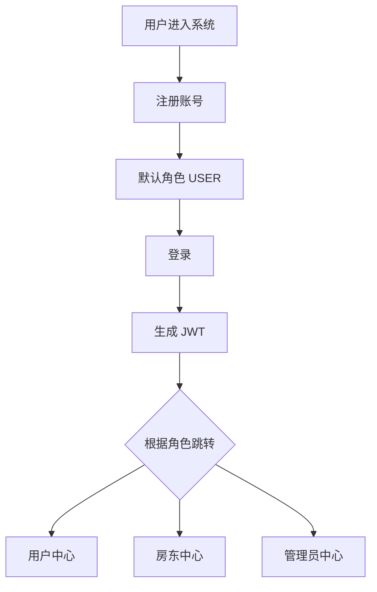
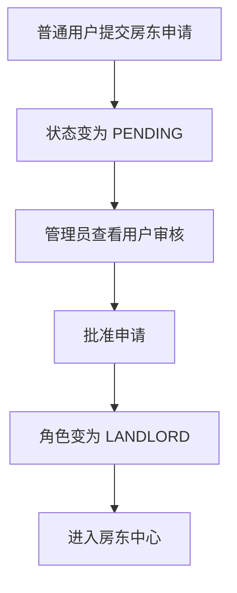
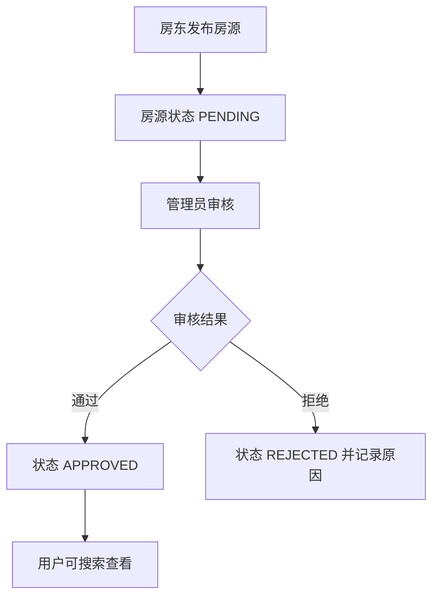
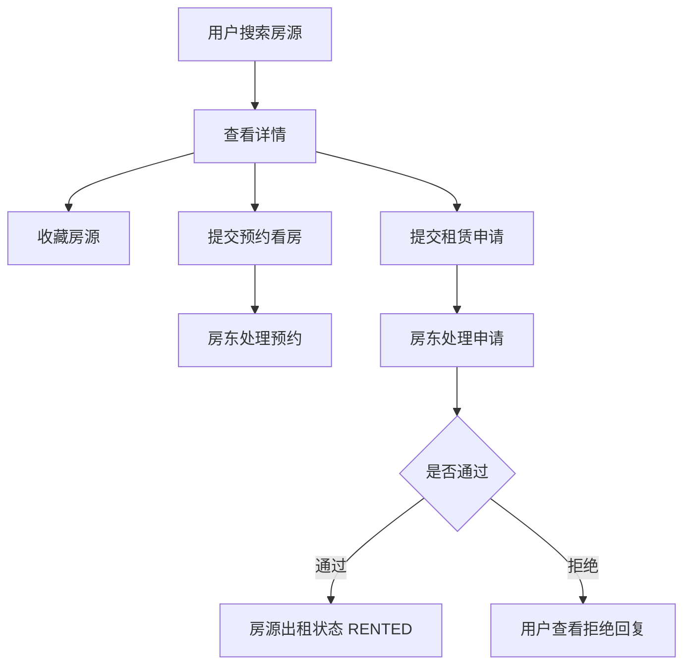

# RentHouse 课程增强版需求分析说明书

## 1. 项目背景与目标

RentHouse 是一个面向课程设计和毕业设计原型展示的租房平台。原项目已经具备用户、房东、管理员三类角色，以及注册登录、房东申请、房源发布、房源审核和基础搜索能力，但整体仍偏向“极简演示”，缺少真实租房场景中的业务闭环。

本次增强的目标是：在不引入复杂商业能力的前提下，补足从“租客找房”到“预约看房”“提交租赁申请”“房东处理申请”“管理员审核和统计”的完整流程，使项目具备更清晰的软件工程需求、数据库设计、接口设计和前端交互。

## 2. 用户角色与业务边界

系统包含三类用户：

- 普通用户：浏览房源、筛选搜索、查看详情、收藏房源、预约看房、提交租赁申请、查看处理进度、申请成为房东、维护个人资料。
- 房东：发布房源、编辑房源、下架房源、查看房源审核结果、处理看房预约、处理租赁申请。
- 管理员：审核房东申请、审核房源、查看用户和房源数据、查看预约和申请统计、维护平台内容质量。

课程增强版不包含线上支付、电子合同、实名认证、地图找房、短信通知、真实图片上传和复杂权限后台。

## 3. 当前系统问题分析

原系统主要问题如下：

- 房源字段过少，只包含标题、价格和位置，难以支撑详情页和筛选需求。
- 搜索能力较弱，只能按位置搜索，缺少租金、户型、面积等常见条件。
- 用户只能看房源，不能收藏、预约或提交租赁申请。
- 房东的“编辑房源”只是前端提示，未接入真实后端接口。
- 管理员审核房源时缺少状态筛选和明确拒绝原因。
- 后台缺少统计概览，无法直观看到用户、房源、预约、申请等数据。
- 前端页面偏简单，首页没有实际房源浏览能力。

## 4. 功能性需求

### 4.1 用户模块

- 用户可以注册账号，系统默认角色为 `USER`。
- 用户可以登录，登录成功后获得 JWT，并根据角色进入对应中心。
- 用户可以查看和更新个人邮箱。
- 普通用户可以提交成为房东的申请。
- 管理员可以批准房东申请，批准后用户角色变更为 `LANDLORD`。

### 4.2 房源模块

- 房东可以发布房源，房源默认进入 `PENDING` 审核状态。
- 房源信息包括标题、租金、位置、描述、户型、面积、楼层、朝向、图片地址、联系人、联系电话。
- 管理员审核通过后，房源状态变为 `APPROVED`，普通用户和未登录用户可以搜索到。
- 管理员拒绝房源时需要填写拒绝原因。
- 房东可以编辑自己的房源，编辑后房源重新进入待审核状态。
- 房东可以下架自己的房源，状态变为 `OFFLINE`。
- 用户可以按位置、租金区间、户型、面积区间筛选房源。

### 4.3 收藏模块

- 普通用户可以收藏已审核通过的房源。
- 普通用户可以查看收藏列表。
- 普通用户可以取消收藏。
- 同一用户不能重复收藏同一房源。

### 4.4 预约看房模块

- 普通用户可以对已审核通过房源提交预约看房。
- 预约信息包含看房时间、联系人、联系电话和备注。
- 用户可以查看自己的预约状态。
- 用户可以取消待处理预约。
- 房东可以查看自己房源下的预约。
- 房东可以确认、拒绝或完成预约，并填写回复。

### 4.5 租赁申请模块

- 普通用户可以对已审核通过房源提交租赁申请。
- 申请信息包含申请人姓名、电话、入住日期、租期和说明。
- 用户可以查看自己的申请进度。
- 用户可以取消待处理申请。
- 房东可以查看自己房源下的租赁申请。
- 房东可以通过或拒绝申请，并填写回复。
- 房东通过申请后，房源出租状态变为 `RENTED`。

### 4.6 管理员统计模块

- 管理员可以查看用户总数、房东数量、待审核房东数量。
- 管理员可以查看房源总数、待审核房源数量。
- 管理员可以查看收藏数量、预约数量、租赁申请数量、待处理申请数量。
- 管理员可以查看租赁申请总览。

## 5. 非功能性需求

- 易用性：页面操作应清晰，用户能在对应角色中心完成主要业务流程。
- 安全性：受保护接口必须校验 JWT 和角色权限。
- 数据一致性：房东只能操作自己的房源、预约和租赁申请。
- 可维护性：保持现有 Spring Boot + JdbcTemplate + Vue 3 + Element Plus 技术栈，不引入过重框架。
- 可演示性：空库初始化后可通过默认管理员完成审核流程。

## 6. 状态定义

- 用户角色：`USER`、`LANDLORD`、`ADMIN`
- 房东申请状态：`NOT_APPLIED`、`PENDING`、`APPROVED`、`REJECTED`
- 房源审核状态：`PENDING`、`APPROVED`、`REJECTED`、`OFFLINE`
- 房源出租状态：`AVAILABLE`、`RESERVED`、`RENTED`
- 预约状态：`PENDING`、`CONFIRMED`、`CANCELLED`、`FINISHED`
- 租赁申请状态：`PENDING`、`APPROVED`、`REJECTED`、`CANCELLED`

## 7. 核心业务流程

### 7.1 注册登录流程

### 7.2 房东申请流程

### 7.3 房源发布审核流程

### 7.4 预约与租赁申请流程

## 8. 验收标准

- 未登录用户可以在首页浏览已审核房源。
- 普通用户登录后可以搜索、收藏、预约和提交租赁申请。
- 房东可以发布、编辑、下架自己的房源，并处理预约和申请。
- 管理员可以审核房东和房源，并查看统计概览。
- 普通用户不能调用房东接口，房东不能调用管理员接口。
- 房源未审核通过前不能出现在公开搜索结果中。
- 前端构建和后端编译通过。
